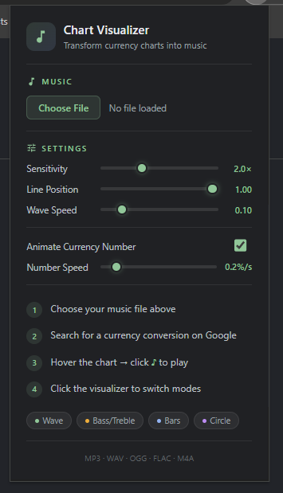

# Chart Music Visualizer

Chart Music Visualizer adalah ekstensi Google Chrome (Manifest V3) yang dirancang untuk mengubah grafik kurs mata uang statis pada hasil pencarian Google menjadi visualizer musik interaktif yang responsif terhadap audio. Ekstensi ini memberikan pengalaman visual yang memadukan data finansial dengan ritme musik secara real-time.

## Demo

Berikut adalah tangkapan layar jendela ekstensi dan rekaman layar penggunaannya:

### Tangkapan Layar Jendela Ekstensi

### Rekaman Layar Ekstensi

## Penjelasan

Ekstensi ini bekerja dengan menyisipkan pemutar audio dan mesin visualisasi berbasis web langsung ke dalam elemen grafik kurs mata uang di Google Search. Ketika pengguna mencari konversi mata uang (seperti USD ke IDR atau EUR ke USD), halaman Google menampilkan grafik fluktuasi nilai tukar. Ekstensi ini mendeteksi grafik tersebut, menempatkan tombol pemutar musik di atasnya, dan menyembunyikan grafik asli untuk digantikan oleh kanvas visualisasi interaktif saat musik diputar.

Selain menyajikan visualisasi grafis, ekstensi ini juga memiliki fitur unik yang dapat menganimasikan digit angka konversi mata uang pada halaman Google agar nilainya terus meningkat secara perlahan mengikuti ketukan musik selama pemutaran berlangsung.

## Fitur Utama

- Integrasi Seamless: Tampilan dan skema warna visualizer dirancang agar serasi dengan antarmuka asli Google Chrome (menggunakan warna abu-abu gelap, hijau, dan biru khas Google).
- Dukungan Format Audio Luas: Kompatibel dengan berkas audio bertipe MP3, WAV, OGG, FLAC, M4A, AAC, dan WMA.
- Empat Mode Visualisasi:
  - WAVE: Gelombang garis yang naik ke atas dari batas dasar bawah sesuai amplitudo suara, dilengkapi efek partikel melayang.
  - BASS / TREBLE: Pemisahan frekuensi suara tinggi (treble) di sisi kiri dengan warna biru dan suara rendah (bass) di sisi kanan dengan warna hijau.
  - BARS: Tampilan equalizer balok klasik dengan efek gradasi warna yang dinamis.
  - CIRCLE: Visualisasi lingkaran radial yang berdenyut di tengah kanvas.
- Preload Musik: Memungkinkan pengguna mengunggah lagu terlebih dahulu melalui menu pop-up ekstensi, sehingga musik dapat langsung diputar ketika tombol visualizer di halaman Google diklik.
- Drag and Drop: Mendukung pengunggahan berkas musik secara instan dengan menyeret dan melepas berkas audio langsung ke area grafik.
- Animasi Angka Mata Uang: Mengubah nilai tukar mata uang yang tertera pada hasil pencarian agar berjalan naik selama lagu diputar, dan mengembalikannya ke nilai semula setelah musik dihentikan.
- Pengaturan Fleksibel: Pengguna dapat menyesuaikan sensitivitas visualizer, posisi garis dasar gelombang, kecepatan render gelombang, serta kecepatan kenaikan angka mata uang melalui antarmuka pop-up.

## Cara Kerja

1. Deteksi DOM (content.js): Saat halaman Google Search dimuat, skrip konten memindai struktur halaman untuk mendeteksi kontainer konverter mata uang menggunakan selector khusus seperti `[data-attrid*="CurrencyConverter"]`.
2. Injeksi Tombol Trigger: Ketika area grafik ditemukan, ekstensi menyematkan tombol pemicu interaktif berupa ikon musik (♪) di sudut kanan atas grafik.
3. Manajemen State dan Penyimpanan: Ekstensi menggunakan penyimpanan lokal (`chrome.storage.local`) untuk mengingat setelan pengguna (sensitivitas, mode, dll.) serta menyimpan data biner lagu yang di-preload dalam format Data URL (Base64).
4. Pemrosesan Audio (Web Audio API): Setelah berkas audio dipilih (baik dari preload, file picker, maupun drag and drop), objek `AudioContext` dibuat. Sinyal audio dialirkan melalui `AnalyserNode` untuk diekstraksi menjadi data domain waktu (time domain) dan domain frekuensi (frequency domain).
5. Render Kanvas (Canvas API): Kanvas resolusi tinggi (mendukung DPI layar tinggi/Retina) disisipkan untuk menggantikan grafik Google sementara waktu. `visualizer.js` membaca data audio dari analyser sebanyak 60 kali per detik dan menggambarnya ke kanvas sesuai dengan mode visualisasi yang sedang aktif.
6. Manipulasi Teks Angka: Selama lagu diputar, skrip mencari elemen teks dan input yang berisi angka konversi mata uang, kemudian mengubah nilainya secara berkala menggunakan rumus matematis berbasis waktu (requestAnimationFrame). Skrip mengembalikan teks ke angka asli saat visualizer dinonaktifkan atau lagu selesai diputar.

## Cara Menggunakan

### 1. Pemasangan Ekstensi di Google Chrome

Karena ekstensi ini dipasang dalam mode pengembang (Developer Mode):
1. Unduh atau salin seluruh kode sumber proyek ini ke dalam satu folder di komputer Anda.
2. Buka Google Chrome dan ketik `chrome://extensions/` pada bilah alamat, lalu tekan Enter.
3. Aktifkan opsi Developer mode di sudut kanan atas halaman.
4. Klik tombol Load unpacked di sudut kiri atas.
5. Pilih folder tempat Anda menyimpan file proyek ini. Ekstensi "Chart Music Visualizer" kini telah terpasang.

### 2. Mempersiapkan Berkas Musik dan Pengaturan

1. Klik ikon ekstensi Chart Music Visualizer pada menu toolbar ekstensi Chrome (ikon potongan lagu/musik) untuk membuka menu pop-up.
2. Klik tombol Choose File pada bagian Music untuk memuat berkas lagu dari komputer Anda. Lagu ini akan disimpan di memori lokal peramban sebagai lagu bawaan (preload).
3. Sesuaikan parameter visualisasi melalui slider yang tersedia:
   - Sensitivity: Mengatur seberapa tinggi respons gelombang/balok terhadap volume lagu.
   - Line Position: Mengatur posisi garis dasar gelombang (WAVE dan BASS/TREBLE).
   - Wave Speed: Mengatur kehalusan dan kecepatan redaman transisi gelombang.
   - Animate Currency Number: Centang untuk mengaktifkan animasi kenaikan angka kurs saat lagu diputar.
   - Number Speed: Mengatur persentase kecepatan kenaikan angka kurs per detik.

### 3. Menjalankan Visualizer di Google Search

1. Buka tab baru di Google Chrome dan lakukan pencarian kurs mata uang, misalnya ketik: `USD to IDR` atau `100 EUR to USD`.
2. Arahkan kursor mouse (hover) ke atas grafik kurs mata uang yang muncul di hasil pencarian. Tombol berlogo not balok ♪ akan muncul di sudut kanan atas grafik.
3. Klik tombol ♪ tersebut untuk memutar musik bawaan yang sudah Anda pilih sebelumnya. Visualizer akan langsung aktif menggantikan grafik mata uang.
4. Untuk memutar lagu lain secara instan tanpa melalui menu pop-up, Anda dapat menyeret (drag) berkas audio dari komputer Anda dan melepasnya (drop) langsung ke dalam area grafik tersebut.
5. Saat visualizer berjalan, klik di mana saja pada area kanvas visualizer untuk beralih ke mode visualisasi lainnya (WAVE, BASS / TREBLE, BARS, dan CIRCLE).
6. Untuk menghentikan pemutaran musik dan menampilkan kembali grafik asli Google beserta nilai kurs semula, klik kembali tombol ♪ yang aktif di sudut kanan atas.
